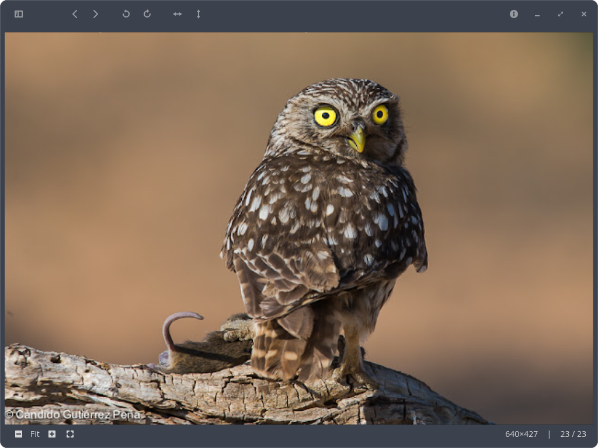

# Noctua

An image viewer application for the COSMIC™ desktop



## Features

- **Multi-format support**: Raster images (PNG, JPEG, WebP, etc.), SVG vector graphics, and PDF documents
- **Navigation**: Browse through folders with keyboard shortcuts
- **Transformations**: Rotate, flip, and crop images
- **Zoom & Pan**: Flexible viewing with zoom controls and panning
- **Multi-page documents**: Navigate PDF pages with thumbnail previews
- **Metadata display**: View EXIF data and file information
- **Wallpaper setting**: Set images as desktop wallpaper (multi-DE support)

## Architecture

Noctua follows Clean Architecture principles with clear separation of concerns.

**Key Patterns:**
- **MVU (Model-View-Update)**: Elm architecture via libcosmic
- **Command Pattern**: Domain operations encapsulated in commands
- **Dependency Inversion**: Domain has no dependencies on infrastructure
- **Type-Erased Documents**: `DocumentContent` enum for unified handling

## Installation

A [justfile](./justfile) is included by default for the [casey/just][just] command runner.

- `just` builds the application with the default `just build-release` recipe
- `just run` builds and runs the application
- `just install` installs the project into the system
- `just vendor` creates a vendored tarball
- `just build-vendored` compiles with vendored dependencies from that tarball
- `just check` runs clippy on the project to check for linter warnings
- `just check-json` can be used by IDEs that support LSP

### Dependencies
#### Arch Linux
```bash
sudo pacman -S poppler-glib
```

#### Debian/Ubuntu
```bash
sudo apt install libpoppler-glib-dev
```

#### Fedora
```bash
sudo dnf install poppler-glib-devel
```

#### OpenSUSE
```bash
sudo zypper install poppler-glib-devel
```

## Documentation

- [Usage](docs/usage.md)
- [Features](docs/features.md)

## License

GPL-3.0-or-later
